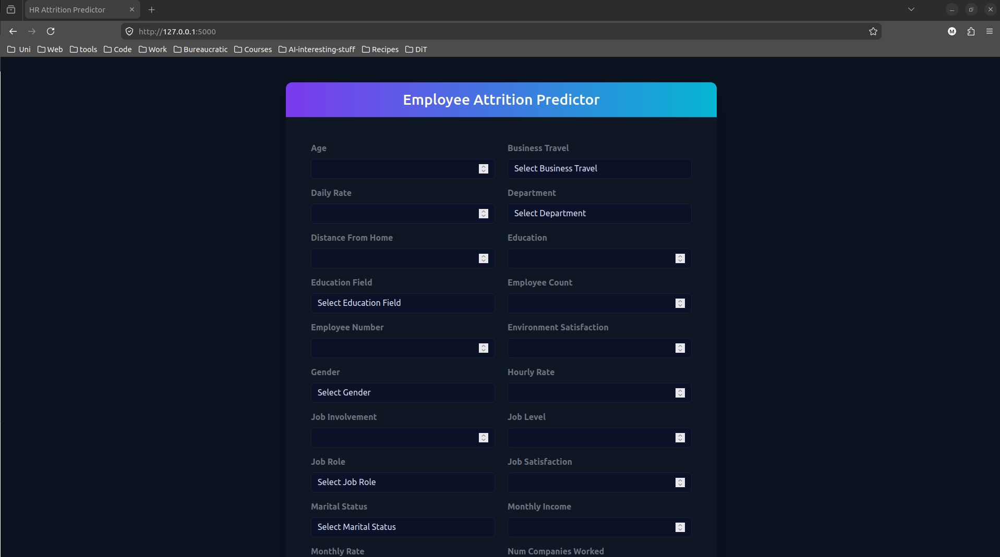
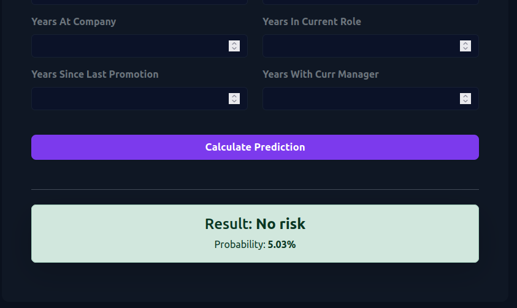

Landing page:

# Flask Application Report: Predictive Model Interface

## 1. Landing Page Interface

The page provides a clean, user-friendly form designed to include all necessary features required by the machine learning model, using a simple, modern dark-themed UI. The interface automatically adapts to categorical dropdowns and numeric inputs based on the model's expected parameters. The features that are used as the form's inputs are gathered by the *csv* file if it exists (for a friendlier user input), otherwise it falls back to the *hr_features.pkl* file that stores the features (less clean - after processing).

---

## 2. Result Screenshot

The result appears at the bottom of the page in a banner using the appropriate colour based on the result (green for no risk, red for risk). The page scrolls into the view of the prediction. A probability is shown along the model prediction. To get probability from *SVM*, I used the *predict_proba* function.

## 3. Application Demo

The user inputs the required data, submits the form, and the backend processes the data in the same way as done before training. Then the data are passed through the model and we get the prediction. The UI dynamically updates to show the final prediction and probability.

Here is a demo of the application. The values are pre-filled (since the form is quite long). The whole form is shown, as well as an example of a categorical variable (overtime) that is used as a select with a dropdown with all its options from the CV and a random numerical output represented with numerical inputs (monthly income). After clicking calculate, the result is shown in the bottom of the page, along with the probability percentage. The page automatically scrolls into view of the result.

[App Demo](https://github.com/user-attachments/assets/2faeccbe-f054-40d4-9f2a-7bc8bd9d25de)

---

## 4. Result Observations & Analysis

During testing and interaction with the web application, a distinct pattern emerged regarding the model's predictions. The model tends to predict low predictions. In order to get a prediction with a "High Risk" result (i.e. with a high probability of attrition), I had to lower all satisfaction levels to 1. Even with medium satisfaction values, the model tended to give quite low probabilies (less than 20%), while with satisfaction values 2, it only went as high as ~45%.
